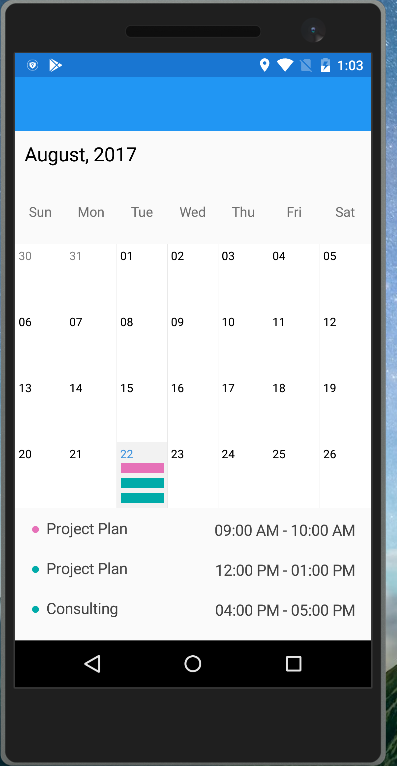

## syncfusion Xamarin forms month view

### Here is what I am getting

### Here is what I want which is already shonw in your website

I just want to do somthing like this shown in your website 
https://www.syncfusion.com/products/xamarin/schedule#recurrence-appointments

# Please explain in [issues](https://github.com/vasani-arpit/Syncfusion.ScheduleMonthViewRendering/issues/new) or create a pull request